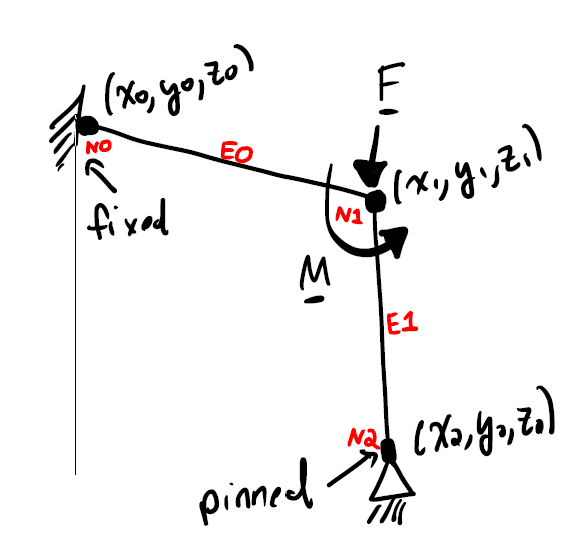
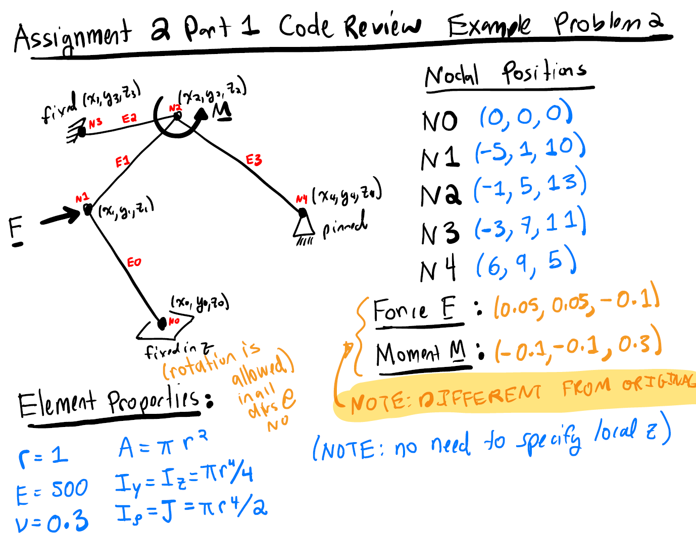
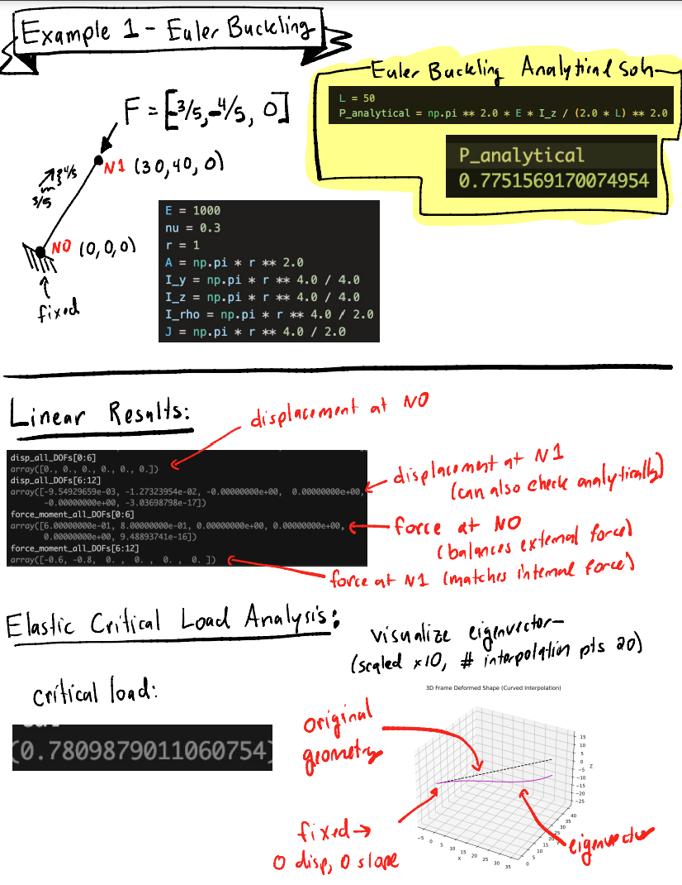
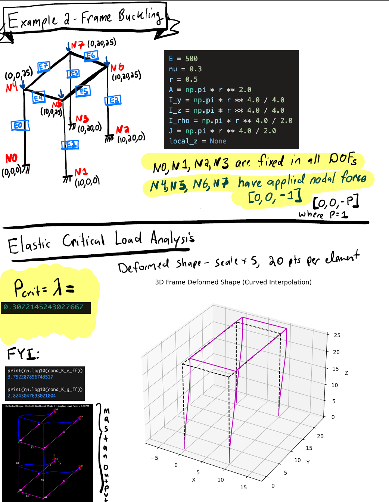
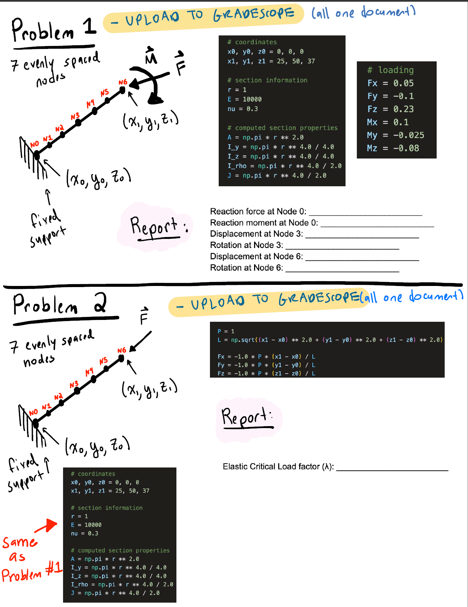
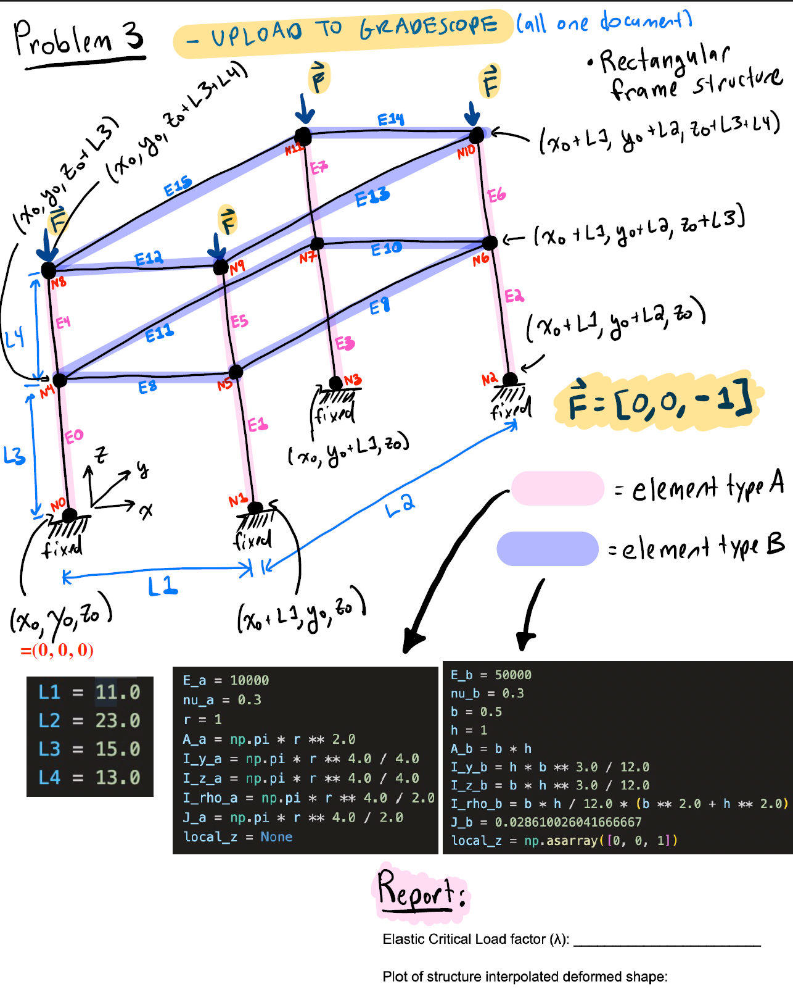

# Matrix Structural Analysis

[](https://www.python.org/)

[](https://github.com/sandialabs/sibl#license)

[](https://codecov.io/gh/Keenan-Wood/BU_ENGME700_KeenanWood_A1)
[](https://github.com/Keenan-Wood/BU_ENGME700_KeenanWood_A1/actions)

---

### Table of Contents
* [The Method](#algo)
* [Conda environment, installation, and testing](#install)
* [Documentation & Examples](#tutorial)
* [More Information](#more)

---

### Conda environment, install, and testing <a name="install"></a>

To install this package, please begin by setting up a conda environment and activating it. For example:
```bash
conda create --name me700-env python=3.12
conda activate me700-env
```

Navigate to the project directory (./Part_1) and create an editable install of the code:
```bash
pip install -e .
```

Test that the code is working with pytest:
```bash
pytest -v --cov=newtonmethod --cov-report term-missing
```

If you are using VSCode to run this code, don't forget to set VSCode virtual environment to the newly-activated environment.

---

#### **Documentation**

**load_frame function**
*(all_disps, all_forces, crit_factor, crit_vec) = load_frame(nodes, elements, xsection, constraints, forces)*

Inputs:
1. nodes - 2D numpy array of node coordinates (#Nodes x 6)  
    ie. for two nodes n0 and n1:  
    nodes = np.array([[n0x, n0y, n0z, n0tx, n0ty, n0tz], [n1x, n1y, n1z, n1tx, n1ty, n1tz]])  
    where tx, ty, and tz represent the angular coordinates of the nodes (typically 0 to start)  

2. elements - nested list containing element information (#Elements x 4)  
    ie. for two elements el0 and el1:  
    elements = [[el0_node_a_id, el0_node_b_id, el0_section_id, el0_zvec], [el1_node_a_id, el1_node_b_id, el1_section_id, el1_zvec]]  

3. xsection - nested list of section properties (#Different Sections x 7)  
    xsection = [[E, A, I_y, I_z, I_rho, J, nu]] creates a section with ID 0 with the given properties  

4. constraints - nested list of fixed DOF (#Constrained Nodes x 7)  
    ie. for node 0 with fixed z, node 3 completely fixed, and node 4 pinned:  
    constraints = [[0,0,0,1,0,0,0], [3,1,1,1,1,1,1], [4,1,1,1,0,0,0]]

5. forces - nested list of forces on each DOF for indicated nodes (#Forced Nodes x 7)  
    ie. forces and moments applied to node 1:  
    forces = [[1, -0.05, 0.075, 0.1, -0.05, 0.1, -0.25]]

Outputs:  
(all_disps, all_forces, crit_vec) as numpy arrays with size (# Nodes x 6)  
crit_factor as float

---

#### **Tutorial/Examples**

The following examples are from problems posted for in-class code reviews in ENG ME700 (Spring 2025).
They can also be found in Direct_Stiffness/src/example_problems_script.py for convenient use.

##### 1.

Here is an example of how to create a frame, apply a load to it, and see the results.
This example corresponds to the first one presented in "Assignment 2 - Code Review 1 - Example Problems":


There are three nodes, two elements with given z-directions, and one cross section shared by all elements.

Each row of the 'nodes' array contains the coordinate of a node - the index of the row is the node's id.

A list of elements is created, where the parameters for each element are given as a list of two node ids, the cross section id, and the z-vector. Both the z-vector and the cross section can be omitted if the z-vector can be assumed and if there is only one cross section in the frame, respectively.

    # Frame geometry definition
    nodes = np.array([[0,0,10], [15,0,10], [15,0,0]])
    elements = [[0, 1, 0, [0,0,1]], [1, 2, 0, [1,0,0]]]

    # Cross section list
    (E, v) = (1000, 0.3)
    (b, h, J) = (.5, 1, 0.02861)
    xsection = [[E, v, 'rectangle', [b, h, J]]]

    # Constraint list (node_id, fixed DOF)
    constraints = [[0,1,1,1,1,1,1], [2,1,1,1,0,0,0]]

    # Force list (node_id, forces on each DOF)
    forces = [[1, -0.05, 0.075, 0.1, -0.05, 0.1, -0.25]]

    # Create frame, apply loads, and display results
    simple_frame = frame(nodes, xsection, elements, constraints)
    simple_frame.apply_load(forces, 30)
    print("\nCode Review 1 - Problem 1:\n")
    simple_frame.print_deformed_results()

##### 2. 

This example corresponds to the first example presented in "Assignment 2 - Code Review 1 - Example Problems":


    # Frame geometry definition
    nodes = np.array([[0,0,0], [-5,1,10], [-1,5,13], [-3,7,11], [6,9,5]])
    elements = [[0,1], [1,2], [2,3], [2,4]]

    # Cross section list
    (E, v) = (500, 0.3)
    r = 1
    xsection = [[E, v, 'circle', [r]]]

    # Constraint list (node_id, fixed DOF)
    constraints = [[0,0,0,1,0,0,0], [3,1,1,1,1,1,1], [4,1,1,1,0,0,0]]

    # Force list (node_id, forces on each DOF)
    forces = [[1, 0.05, 0.05, -0.1, 0, 0, 0], [2, 0, 0, 0, -0.1, -0.1, 0.3]]

    # Create frame, apply loads, and display results
    simple_frame = frame(nodes, xsection, elements, constraints)
    simple_frame.apply_load(forces, 30)
    print("\nCode Review 1 - Problem 2:\n")
    simple_frame.print_deformed_results()
    simple_frame.plot_deformed()

#### 3.

This example corresponds to the first example presented in "Assignment_2_Code_Review_Part_2_.pdf":


    # Frame geometry definition
    nodes = np.array([[0,0,0], [30,40,0]])
    elements = [[0,1]]

    # Cross section list
    (E, v) = (1000, 0.3)
    r = 1
    xsection = [[E, v, 'circle', [r]]]

    # Constraint list (node_id, fixed DOF)
    constraints = [[0,1,1,1,1,1,1]]

    # Force list (node_id, forces on each DOF)
    forces = [[1, -3/5, -4/5, 0, 0, 0, 0]]

    # Create frame, apply loads, and display results
    simple_frame = frame(nodes, xsection, elements, constraints)
    simple_frame.apply_load(forces, 30)
    print("\nCode Review 2 - Problem 1:\n")
    simple_frame.print_deformed_results()
    simple_frame.plot_deformed()

#### 4.

This example corresponds to the second example presented in "Assignment_2_Code_Review_Part_2_.pdf":


    # Frame geometry definition
    (Lx, Ly, Lz) = (10, 20, 25)
    x = [0, Lx, Lx, 0, 0, Lx, Lx, 0]
    y = [0, 0, Ly, Ly, 0, 0, Ly, Ly]
    z = [0, 0, 0, 0, Lz, Lz, Lz, Lz]
    nodes = np.array([np.array([x[i], y[i], z[i], 0, 0, 0]) for i in range(0, 8)])
    elements = [[i, i+4] for i in range(0, 4)]
    elements.extend([4 + i, 4 + (i+1) % 4] for i in range(0, 4))

    # Cross section list
    (E, v) = (500, 0.3)
    r = 0.5
    xsection = [[E, v, 'circle', [r]]]

    # Constraint list (node_id, fixed DOF)
    constraints = [[i,1,1,1,1,1,1] for i in range(0, 4)]

    # Force list (node_id, forces on each DOF)
    forces = [[i,0,0,-1,0,0,0] for i in range(4, 8)]

    # Create frame, apply loads, and display results
    simple_frame = frame(nodes, xsection, elements, constraints)
    divided_frame = simple_frame.subdivide(2)
    divided_frame.apply_load(forces, 20, 5)
    print("\nCode Review 2 - Problem 2:\n")
    divided_frame.print_deformed_results()
    divided_frame.plot_deformed("buckled")

#### 5.

This example corresponds to the first and second problem presented in "Assignment_2_Final_Code_Review.pdf":


    # Frame geometry definition
    (x, y, z) = (np.linspace(0, 25, 7), np.linspace(0, 50, 7), np.linspace(0, 37, 7))
    nodes = np.array([np.array([x[i], y[i], z[i], 0, 0, 0]) for i in range(0, 7)])
    elements = [[i, i+1, 0, []] for i in range(0, 6)]

    # Cross section list
    (E, v) = (10000, 0.3)
    r = 1
    xsection = [[E, v, 'circle', [r]]]

    # Constraint list (node_id, fixed DOF)
    constraints = [[0,1,1,1,1,1,1]]

    # Problem 1 - Force list (node_id, forces on each DOF)
    forces = [[6, 0.05, -0.1, 0.23, 0.1, -0.025, -0.08]]

    # Create frame, apply loads, and display results
    simple_frame = frame(nodes, xsection, elements, constraints)
    simple_frame.apply_load(forces, 30)
    print("\nTechnical Correctness 1 - Problem 1:\n")
    simple_frame.print_deformed_results()
    simple_frame.plot_deformed()

    # Problem 2 - Force list (node_id, forces on each DOF)
    P = 1
    L = np.linalg.norm(np.array([25, 50, 37]))
    (Fx, Fy, Fz) = (-25*P/L, -50*P/L, -37*P/L)
    forces_2 = [[6, Fx, Fy, Fz, 0, 0, 0]]

    # Create frame, apply loads, and display results
    
    simple_frame.apply_load(forces_2, 30)
    print("\nTechnical Correctness 1 - Problem 2:\n")
    simple_frame.print_deformed_results()
    simple_frame.plot_deformed()

#### 6.

This example corresponds to the third problem presented in "Assignment_2_Final_Code_Review.pdf":


    # Frame geometry definition
    (L1, L2, L3, L4) = (11, 23, 15, 13)
    x = [0, L1, L1, 0, 0, L1, L1, 0, 0, L1, L1, 0]
    y = [0, 0, L2, L2, 0, 0, L2, L2, 0, 0, L2, L2]
    z = [0,0,0,0, L3,L3,L3,L3, L3+L4,L3+L4,L3+L4,L3+L4]
    nodes = np.array([np.array([x[i], y[i], z[i], 0, 0, 0]) for i in range(0, 12)])
    z_vec2 = np.array([0, 0, 1])
    elements = [[i, i+4, 0, []] for i in range(0, 8)]
    elements.extend([4*lvl + i, 4*lvl + (i+1)%4, 1, z_vec2] for i in range(0, 4) for lvl in [1,2])

    # Cross section list
    (E1, v1, E2, v2) = (10000, 0.3, 50000, 0.3)
    (r, b, h, J2) = (1, 0.5, 1, 0.028610026041666667)
    xsection = [[E1, v1, 'circle', [r]], [E2, v2, 'rectangle', [b, h, J2]]]

    # Constraint list (node_id, fixed DOF)
    constraints = [[i,1,1,1,1,1,1] for i in range(0,4)]

    # Force list (node_id, forces on each DOF)
    forces = [[i,0,0,-1,0,0,0] for i in range(8,12)]

    # Create frame, apply loads, and display results
    simple_frame = frame(nodes, xsection, elements, constraints)
    simple_frame.apply_load(forces, 30)
    print("\nTechnical Correctness 1 - Problem 3:\n")
    simple_frame.print_deformed_results()
    simple_frame.plot_deformed("buckled")

---

### More information <a name="more"></a>
More information can be found here:
* https://digitalcommons.bucknell.edu/cgi/viewcontent.cgi?article=1006&context=books
* https://learnaboutstructures.com/Matrix-Structural-Analysis-Introduction